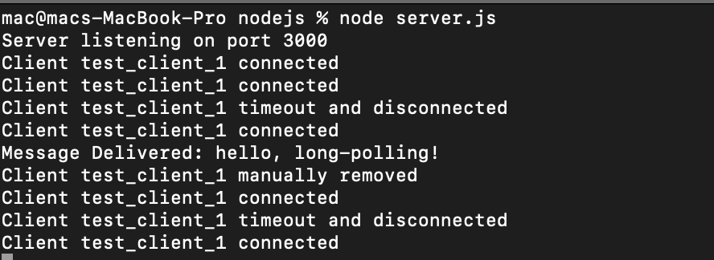

# Long-Polling Example

This repository contains examples of **long-polling** implemented in **Node.js**, **Django**, and a simple **React** client.

---

## 📚 What is Long-Polling?

**Long-polling** is a technique where the client opens a connection to the server and waits until:
- The server has a new message to send, or
- A timeout occurs.

Here's how the long-polling flow works:
1. **Client A** opens a connection asking if there are new messages.
2. The server keeps the connection open:
   - If a new message for **Client A** arrives before the timeout, the server immediately sends it.
   - If no message arrives and the timeout is reached, the server closes the connection.
3. After receiving a message or on timeout, **Client A** immediately opens a new connection, repeating the process.

---

## 🚀 How to Run the Examples

### Node.js Server
1. Navigate to the `nodejs` directory:
   ```bash
   cd nodejs
   node server.js
   ```
2. Navigate to the `react-client` directory and run:
   ```bash
   npm run dev
   ```

3. Use `cURL` to post a message to the server, example:
    ```bash
    curl -X POST http://localhost:3000/poll/send \
    -H "Content-Type: application/json" \
    -d '{"to": "test_client_1", "message": "your message"}'
    ```

### 🐍 Django Server
Two different implementations of **long-polling**:

1. **Loop-based Polling** (Commented Out in the code)
   - This approach checks every second there are new messages for the client.
   - **Drawbacks:**
     - This method is CPU-intensive because it checks for messages every second, even if none are available, which results in wasting CPU usage if no message is present.

     - It can introduce up to 1 second of latency, since a message might arrive just after a check and won’t be picked up until the next one.

     - After the 30-second long-polling timeout is reached, the thread sleeps for one second, adding extra delay.

2. **Redis `BLPOP`-based Polling**:
   - This is a blocking version of `LPOP` in Redis, which holds the client connection until a message is pushed to the queue or the timeout is reached, and prevents the polling every second to check for a new message. 
   - **Benefits:**
     - More CPU-efficient, as the client is blocked until a message is received or timeout reached. 
     - Lower latency,the 1-second latency is eliminated here, once the message is available, it is immediately delivered to the client.

**Note:** you need to keep in mind that `BLPOP` according to [Redis documentation](https://redis.io/docs/latest/commands/blpop/), removes the element from the queue once it returns it, which means if the client crashes before fully processing the returned message, that message is lost. You should design your system to account for this (e.g., by using a separate persistence layer or acknowledgment mechanism). We use `BLPOP` as a signaling mechanism to reduce CPU overhead, leveraging Redis's efficient event-driven architecture.

In order to run the django example, follow the previous steps for running the `react` client, and `cURL` to post a message. The first variant of django code (using a loop) is commented, you can uncomment it and comment the `BLPOP` variant.

Navigate to the `django` directory and run the command below in order to start the server:
   ```bash
   python manage.py runserver
   ```
---
## 📌 Additional Notes
- If the client is connected and waiting, the message will be delivered immediately.

- If no client is connected with the given ID, the server will log that the client is not connected.

- The connection automatically times out after 30 seconds if no message is received.




---
## Technologies Used
- Node.js (Express)

- Django

- React (Vite for frontend setup)

- cURL (for manual testing)
